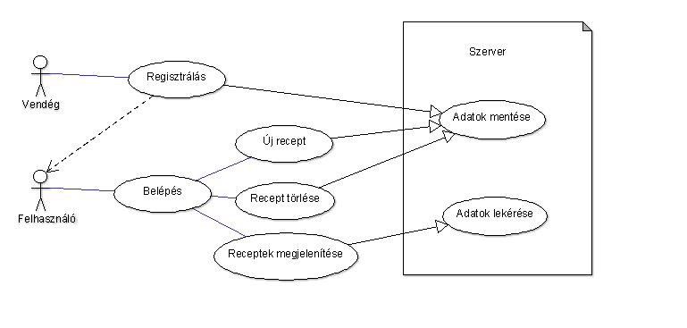
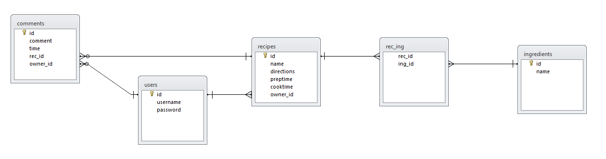

# Documentáció a RecipeBay-hez

## Készítette: Hanyecz Dominik és Buzogány Attila

### Követelmények

#### Funkcionális elvárások
##### Regisztráció:
Új felhasználók a kezdőlapon megadhatnak egy felhasználói nevet és jelszót, majd a Regisztrálás gomb lenyomására új fiókot hozhatnak létre maguknak, amivel a program többi funkcióit érhetik el.

Ha a megadott felhasználói név már foglalt, vagy az adatbázis nem elérhtő, hibaüzenet értesíti a felhasználót

##### Belépés:
Fiókkal rendelkező felhasználók bejelentkezhetnek a Bejelentkezés gomb lenyomásával miután megadták felhasználói nevüket és jelszavukat.

Ha a megadott név+jelszó páros nincs az adatbázisban, hibaüzenet értesíti a felhasználót.

##### Új recept felvétele:
Bejelentkezés után Az Új Recept Felvétele gomb lenyomása után egy felugró ablak kéri a felhasználót hogy a következő adatokat adja meg a receptről:
-A recept neve
-Utasítások az elkészítéshez
-Hozzávalók megadása
	--Kétféleképpen teheti meg ezt:
	--1. Az adatbázisban lévő hozzávalók kiválasztásával.
	--2. Új hozzávaló megadásával ami külön eltárolódik az adatbázisban.
-Előkészületi idő
-Főzési/sütési idő

Miután megadta az adatokat a felhasználó az adatokat eltárolódik az adatbázisban.

##### Tárolt recept megtekintése:
A belépést követően a program kilistázza automatikusan a tárolt receptek nevét, elkészítési idejét és a feltöltő felhasználói nevét megjelenítve egy táblázatban.
A többi adat megtekintéséhez a megfelelő sor végén lévő gombra kattintva egy felugró ablak jeleníti meg.

##### Tárolt recept törlése:
A belépést követően a program kilistázza automatikusan a tárolt receptek nevét, elkészítési idejét és a feltöltő felhasználói nevét megjelenítve egy táblázatban.
A többi adat megtekintéséhez a megfelelő sor végén lévő gombra kattintva törölheti az adott receptet az adatbázisból.

#### Nem funkcionális elvárások

##### Biztonság
  - Nincs garancia az adatok biztonságára.

##### Hatékonyság
  - Adatok listázása vagy szűrése során a válaszidő a tárolt adatok mennyiségével nő.

##### Hordozhatóság
  - A program másolás útján újratelepíthető más szerverre.

#### Használatieset-modell

##### Aktorok:
  - Regisztrált felhasználók
  - Vendégek

#### Adatbázisterv

