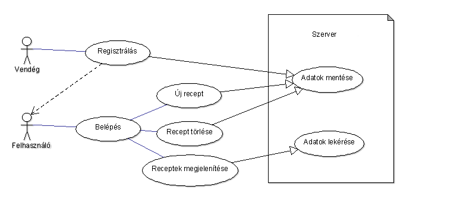

# Documentáció a RecipeBay-hez

## Készítette: Hanyecz Dominik és Buzogány Attila

### Követelmények

#### Funkcionális elvárások
##### Regisztráció:

##### Belépés:

##### Új recept felvétele:

#### Nem funkcionális elvárások

##### Hatékonyság
  - Adatok listázása vagy szűrése során a válaszidő a tárolt adatok mennyiségével nő
  

#### Használatieset-modell

##### Aktorok:
  - Regisztrált felhasználók
  - Vendégek

### Tervezés

#### Architektúra

#### Felhasználóifelület-modell

#### Osztálymodell
##### Adatmodell

##### Adatbázisterv

##### Állapotdiagram

### Implementáció
#### Fejlesztői környezet
#### Könyvtárstruktúra bemutatása

